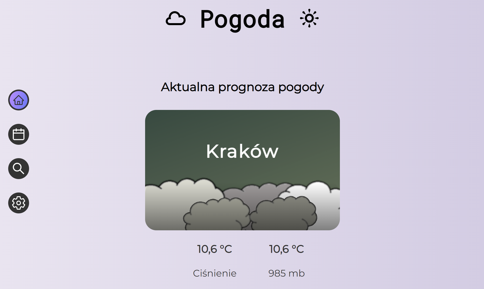
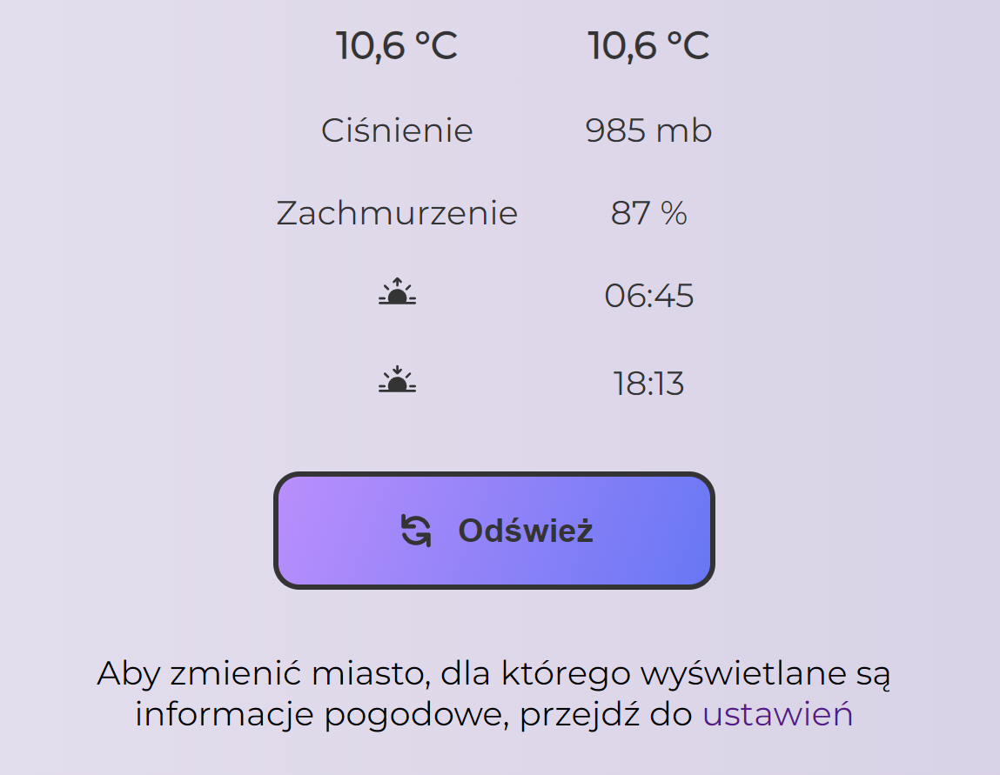
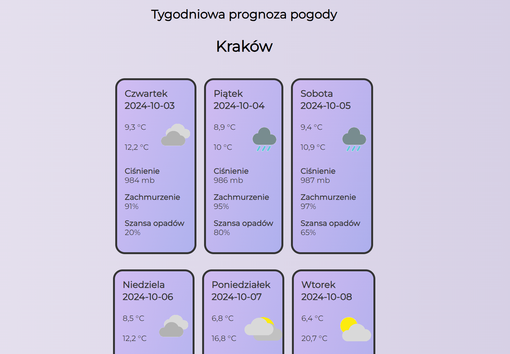
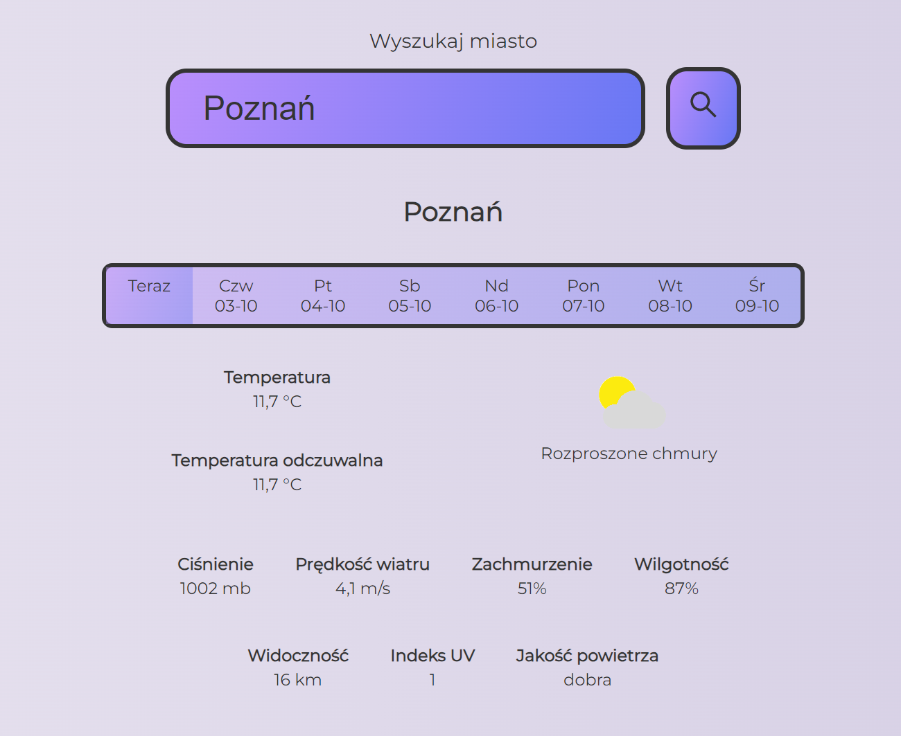
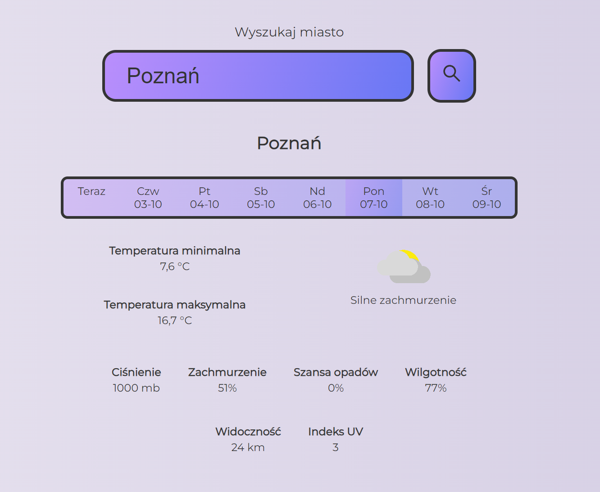
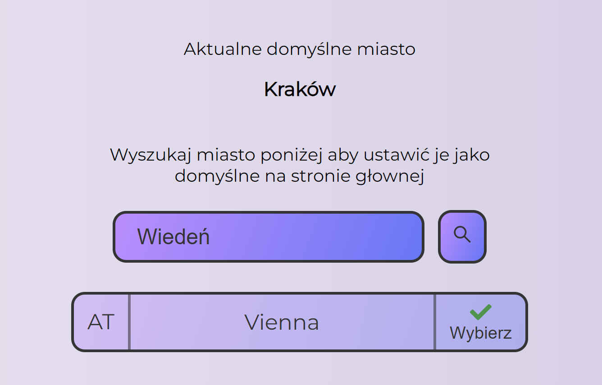

Web app made in <b>React</b> that uses [Weatherbit.io](https://www.weatherbit.io/) Rest API to show weather information.
 
Current and weekly weather forecast (for the default selected city) is requested from an API and saved locally using cookies. Apart of what the weather is like, information provided is: temperature, air pressure, cloudiness, times of sunrise and sunset.
 
To get more complex info (such as chanse of rain, humidity, visibility, UV index) user can go to `Search` tab and chose a city.
  
Technologies used in project: <i>React, JavaScript, Rest API, Styled Components</i>

 

Aplikacja webowa napisana przy pomocy <b>React</b> używająca Rest API od [Weatherbit.io](https://www.weatherbit.io/) do wyświetlania informacji pogodowych.
 
Aktualna i tygodniowa prognoza (dla domyślnego wybranego miasta) jest uzyskiwana dzięki API i zapisywana lokalnie poprzez cookies. Poza stanem pogody aplikacja oferuje takie informacje jak: temperatura, ciśnienie powietrza, zachmurzenie, godzinę wschodu i zachodu słońca.
 
Po bardziej złożone dane (szansa opadów, wilgotność, widoczność, indeks UV) użytkownik może zajrzeć do odpowiedniej zakładki i wyszukać żądane miasto.
  
Technologie wykorzystane w projekcie: <i>React, JavaScript, Rest API, Styled Components</i>

 

 

 

 

 

 

